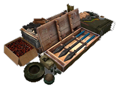
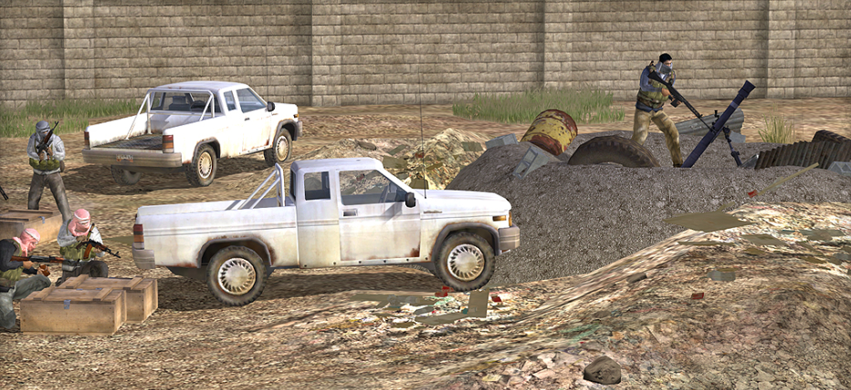
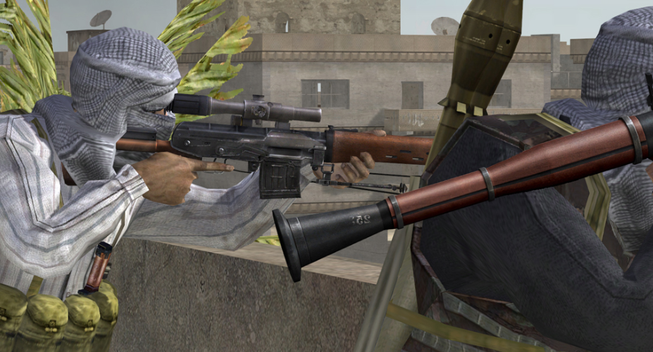
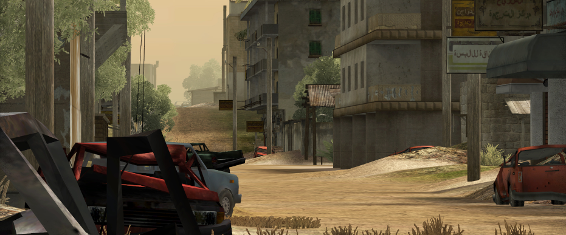

# Guia rápido INS

<figure><figcaption></figcaption></figure>

1. **Proteção dos Cachês:**
   * **Posicionamento Estratégico:** Coloque-se em locais que ofereçam boa cobertura e visibilidade dos cachês. Utilize o terreno ao seu favor para evitar ser detectado.
   * **Defesa Ativa:** Fique atento a movimentos inimigos e esteja pronto para responder rapidamente a qualquer tentativa de ataque aos cachês.
2. **Evitar Revelar Localização:**
   * **Silêncio e Cautela:** Evite disparos ou atividades que possam chamar a atenção para os cachês. Evitar conflitos próximos a eles a menos que seja absolutamente necessário.
   * **Táticas de Distração:** Utilize táticas para atrair a atenção do inimigo para longe dos cachês, permitindo que outros membros da equipe se posicionem para a defesa.
3.  **Uso Apropriado de IEDs e Armadilhas:**

    * **Implantação Estratégica:** Coloque IEDs em rotas prováveis de acesso do inimigo, mas evite instalá-los muito perto dos cachês para não arriscar o 'spawn camping'.

    

    <figure><figcaption>
Mashallah
</figcaption></figure>

    

4.  **Colaboração com a Equipe:**

    * **Comunicação Constante:** Mantenha contato com seus companheiros de equipe. Informe sobre qualquer movimento inimigo e coordene estratégias de defesa.
    * **Trabalho em Equipe:** Sempre trabalhe em conjunto. Defenda os cachês como uma unidade e evite se separar do grupo.

    

    <figure><figcaption>
Trabalhe em Equipe
</figcaption></figure>

    

5. **Engajamento com o Inimigo:**
   * **Escolha os Combates com Sabedoria:** Evite confrontos desnecessários. O foco deve ser na defesa dos cachês. Envolver-se em batalhas longe dos cachês pode levar à sua perda.
   * **Retirada Tática:** Se o inimigo estiver em grande número ou em vantagem, considere recuar para um local mais seguro e manter a vigilância sobre os cachês.
6. **Não Abandonar o Combate:**
   * **Comprometimento:** Não saia do combate em locais remotos. Mantenha-se próximo aos cachês e concentre-se em defender seu território.
   * **Reagrupamento:** Se for forçado a se retirar, reúna-se com outros insurgentes e reforce a defesa ao redor dos cachês.

<figure><figcaption></figcaption></figure>


**Objetivo Principal:** Como membros da equipe insurgente, sua principal responsabilidade é proteger os cachês de armas escondidos (Weapons Caches). Você deve usar estratégias defensivas e evitar confrontos desnecessários longe dos objetivos.


Os marcadores no mapa para insurgency são:

*  **Cache de Armas Conhecido pela coalizão:** Esse ícone ficará visível no mapa das forças da coalizão, que indica a localização aproximada do cache quando uma inteligência suficiente foi adquirida. O marcador pode ser compensado até 75m.
*  **Cache de Armas Localizado pela Coalizão:** Este ícone será visível no mapa das forças insurgentes que indica que o cache foi localizado pelas forças de coalizão.
*  **Cache de Armas Insurgentes Desconhecidas:** Este ícone representará a posição do cache onde ele irá aparecer no campo de batalha. Eles são visíveis apenas para as forças insurgentes, para poderem coordenar suas defesas, enquanto as forças da coalizão coletam informações. O cache não será fisicamente gerado até que seja revelado às forças da coalizão.

<figure><picture><source srcset="../.gitbook/assets/imagem_2024-10-23_215103474.png" media="(prefers-color-scheme: dark)"></picture><figcaption>
Use o mapa ao seu favor
</figcaption></figure>


Os caches podem ser destruídos por pacotes pequenos ou grandes de C4. Outro armamento só causará dano leve ou nenhum dano a um cache.

Uma vez destruído, a equipe da coalizão ganha 30 tickets e uma mensagem informará a equipe sobre quantos depósitos ainda serão destruídos. Caches podem ser reparados por chave ou pás.



### _Munições_ 

Para ser capaz de se rearmar, você precisará se aproximar de uma das várias fontes de munição, que então automaticamente recarregará suas armas. Essas fontes são:

* **Bolsas de Munição (Ammo bags)** - Estes podem ser encontrados no rifleman, militante, guerreiro (rifleman, militant, warrior) e alguns kits insurgentes e devem ser lançados (Botão esquerdo do mouse) no chão, para você ou outros soldados poderem se rearmar, ou em estruturas (tow, aa, morteiros) para remuniciar os mesmos.
* **Caixas de Munição (Ammo boxe)** - Derrubado por veículos leves transportados, APCs e IFVs.
* **Caixas de Suprimento (Supply Crate)** - Mais informações no [next section](https://www.realitymod.com/manual/br/the\_basics.html#crates)
* **Caches de armas** - Disponível apenas para insurgentes
* **Depósito de veiculos (informalmente conhecido como reparo)** - Presente em todas as bases principais, também te cura

> 
>
> Bolsa de munição, Caixa de munição das forças da Coalizão, Caixa de munição das forças Insurgentes, Cache de armas e depósito de veículos.

<mark style="color:red;">**Esteja ciente de que, com exceção de caches e depósito de veículos (reparo da base principal), todas as outras fontes de munição são limitadas. Eventualmente, essas fontes se esgotarão e desaparecerão. É até possível que as fontes de munição se esgotem antes de você ser totalmente rearmado.**</mark>


***

## **Forças da Coalizão (BLUFOR)**

* **Patrulhamento e Busca por Cachês:**
  * **Inteligência e Reconhecimento:** Coordene-se com outros esquadrões para patrulhar áreas suspeitas e usar o reconhecimento para localizar os cachês. Informe a equipe sobre qualquer movimento inimigo ou presença de estruturas suspeitas.
  * **Busca Minuciosa:** Não passe por áreas rapidamente. Procure em locais escondidos, dentro de construções e nas proximidades de vilarejos onde os insurgentes possam esconder os cachês.
* **Uso de Veículos e Suporte Aéreo:**
  * **Coordenação com a Infantaria:** O suporte aéreo e os veículos blindados devem atuar em conjunto com a infantaria, fornecendo cobertura e transporte seguro durante as buscas.
  * **Reconhecimento Aéreo:** Use helicópteros para fazer reconhecimento de áreas de difícil acesso ou de grandes áreas rapidamente.
  * **Evite Expor-se Desnecessariamente:** Movimente-se com cautela e certifique-se de que os veículos estão sendo usados estrategicamente, para apoiar a busca e destruir os cachês, sem se tornarem alvos fáceis.
*   **Eliminação de Resistência Insurgente:**

    * **Engajamento Preciso:** Ao encontrar insurgentes, elimine-os de maneira eficiente para abrir caminho para a busca dos cachês. Evite se envolver em combates prolongados que possam desviar a atenção da missão principal.
    * **Neutralize Armadilhas:** Fique atento a IEDs e minas que os insurgentes possam ter colocado ao redor dos cachês. Use engenheiros para desarmá-los com segurança.

    <figure><picture><source srcset="../.gitbook/assets/image (7).png" media="(prefers-color-scheme: dark)"></picture><figcaption>
POV: Perdeu JOW!!! Cade o cache Safado?
</figcaption></figure>
* **Destruição dos Cachês:**
  * **C4 e Explosivos:** Uma vez que um cachê for localizado, utilize C4 ou outros explosivos adequados para destruí-lo. Verifique sempre a área antes de plantar os explosivos para evitar teamkills acidentais.
  * **Cobertura durante a Destruição:** Garanta que a equipe cubra quem estiver plantando explosivos no cachê. Os insurgentes podem tentar se reagrupar e proteger seu recurso vital.
* **Comunicação e Coordenação:**
  * **Comandante e Líderes de Esquadrão:** A coordenação entre o Comandante e os líderes de esquadrão é vital. As patrulhas devem ser organizadas para cobrir o máximo de terreno possível, sem deixar áreas vulneráveis desprotegidas.
  * **Compartilhamento de Informações:** Comunique-se constantemente com outros esquadrões. Se um cachê for localizado, avise imediatamente para que reforços possam ser enviados ou para que o suporte aéreo possa ser acionado.
* **Evitar Teamkills e Captura Inapropriada de Veículos:**
  * **Verifique suas Coordenadas:** Ao usar explosivos ou chamar suporte aéreo, certifique-se de que aliados não estão na zona de impacto. Teamkills podem comprometer seriamente a operação.
  * **Captura de Veículos Insurgentes:** Somente veículos insurgentes que fazem sentido lógico de serem operados por forças da coalizão podem ser capturados. Evite roubar veículos que seriam irreais para a Coalizão operar, para evitar punições.
* **Foco no Objetivo:**
  * **Destruir Cachês, Não Farmar Kills:** O objetivo principal é localizar e destruir os cachês, não se concentrar em matar insurgentes sem propósito. Não prolongue a partida se focando apenas em combate.
  * **Ataques Precisos:** Evite ações de "kill farming" e foque nos objetivos que trarão a vitória, que é destruir o máximo de cachês possível.


No modo Insurgência, os civis são personagens **não-combatentes** presentes no campo de batalha. Atirar ou matar civis **resulta em penalidades severas** para a equipe da coalizão (BLUFOR). Isso pode incluir a perda de tickets, pontos de inteligência e outras consequências negativas.

