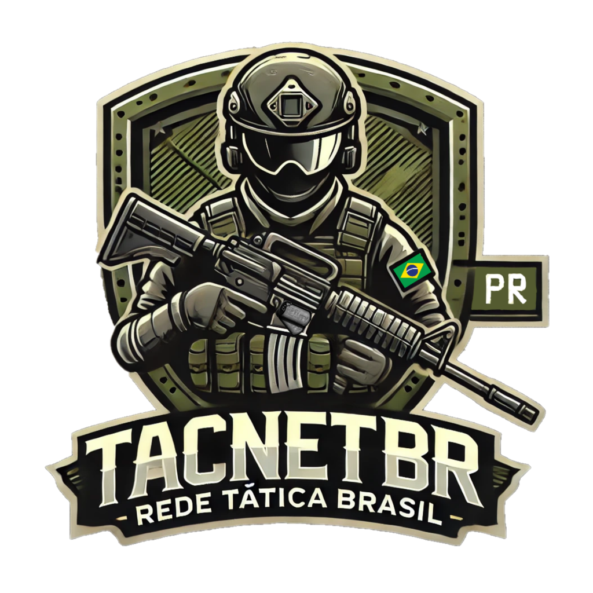

# SOBRE NÓS TACNET.BR

<figure><figcaption></figcaption></figure>

> ### Olá, jogadores e entusiastas do **Project Reality**! É com grande entusiasmo que apresentamos a **TACNET.BR**, uma nova comunidade dedicada a oferecer uma experiência focada em táticas e trabalho em equipe. Nossa Equipe está de porta abertas para receber tanto novos jogadores como veteranos.

_A Rede Tática Brasil pretende expandir seus servidores para demais jogos conforme a demanda. Claro não se preocupem esta comunidade está aqui para trazer mais diversão para a comunidades        <mark style="color:yellow;">(South America)</mark> Já para jogadores que estão próximo a <mark style="color:red;">(Europa)</mark> visite nossa afilial **\[TACNET.DE]** Fundada desde 2013 Presidente do grupo Tactical Network **@Guenix**_&#x20;

<mark style="color:purple;">**TACNET.DE:**</mark>



<mark style="color:green;">**\[TacNet.DE] Tactical Network.de - Vanilla**</mark> IP: <mark style="color:green;">**144.76.105.109**</mark>**&#x20;PORT:**<mark style="color:green;">**2352**</mark>



\[TacNet.DE] Tactical Network.de - ACE/ACRE IP: <mark style="color:green;">**144.76.105.109**</mark>**&#x20;PORT:&#x20;**<mark style="color:green;">**2336**</mark>



<mark style="color:yellow;">**\[TacNet.DE]**</mark><mark style="color:orange;">**Tactical Network.de -**</mark> IP: <mark style="color:green;">**144.76.105.109**</mark>**&#x20;PORT:&#x20;**<mark style="color:green;">**27028**</mark>



<mark style="color:blue;">**Tactical Network.de - Minecraft #1**</mark> IP: <mark style="color:green;">**144.76.105.109**</mark>**&#x20;PORT:**<mark style="color:green;">**25565**</mark>



<mark style="color:purple;">**TACNET.BR**</mark>



#### .png>)\[TACNET.BR] **Rede Tatica Brasil IP:**<mark style="color:green;">**168.75.99.81**</mark>PORT:<mark style="color:green;">**27439**</mark>**-&#x20;**<mark style="color:blue;">**(MANUTENÇÂO)**</mark>

.png>)\[TACNET.BR] **Rede Tatica Brasil IP:**<mark style="color:green;">**103.88.232.169**</mark>**PORT:**<mark style="color:green;">**27035**</mark>**-&#x20;**<mark style="color:blue;">**(MANUTENÇÂO)**</mark>



.png>)<mark style="color:purple;">**\[TACNET.BR] Rede Tatica Brasil**</mark>**&#x20;Z** - <mark style="color:red;">**SERVIDOR OFFLINE**</mark>



_No momento, sem novos servidores.. Algum jogo bacana? Avise nós em nosso Discord!_



### Conheça nosso site:
