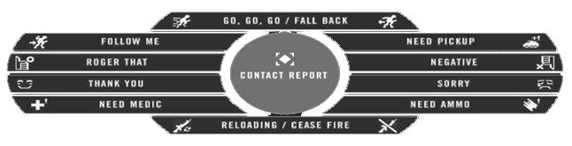

# CONDUTA

## REGRAS DE COMUNICAÇÃO


<mark style="color:red;">**1.1**</mark>- É proibido qualquer tipo de expressão pejorativa, ofensiva, racista ou xenofóbica, seja através de texto, voz, no nickname ou nome do squad

• O uso de palavras como <mark style="color:red;">**"macaco", "boludo", "nigger"**</mark> e etc. será punido severamente

<mark style="color:red;">**1.2**</mark>- É <mark style="color:red;">proibido provocar, ofender ou insultar qualquer pessoa</mark> ou <mark style="color:orange;">revidar provocações</mark>, seja via chat, ou canal de voz&#x20;

<mark style="color:red;">**1.3**</mark>- É <mark style="color:red;">proibido realizar propaganda de outros servidores ou comunidades relacionados ao PR</mark>

• Reclamações, críticas ao servidor, críticas abertas às decisões dos administradores (escolha de mapa, vote, etc) e discussões com administração deverão ser realizados no DISCORD ( <mark style="color:blue;">Temos um canal exclusivo para isso</mark> [#SUPORTE](https://discord.com/channels/1297765086240313385/1297974722121957490) ).

&#x20;• Proibido propaganda, no chat in-game, sem a autorização da direção.



<mark style="color:red;">**1.4**</mark>- É proibido anunciar recrutamento de clãs ou eventos nos chats de time. global ou chat briefing. <mark style="color:purple;">VOIP</mark> geral. ( <mark style="color:blue;">Temos um canal exclusivo para isso</mark> [#SUPORTE](https://discord.com/channels/1297765086240313385/1298643069914185761) ).

<mark style="color:red;">**1.5**</mark>- É <mark style="color:red;">proibido spam ou mensagens que causem discórdia, nos chats de time, global</mark>, report <mark style="color:red;">(!r)</mark> ou chat de voz geral (briefing)

• Entende-se como <mark style="color:orange;">spam a transmissão de mensagens repetitivas e/ou não pertinentes ao jogo</mark>

<mark style="color:orange;">**1.6**</mark> - <mark style="color:green;">**Durante o briefing, o chat (Também Mumble) é livre para conversas paralelas**</mark> <mark style="color:red;">**somente até o momento da criação dos esquadrões (01:30)**</mark>

<mark style="color:red;">**1.7**</mark>- <mark style="color:red;">**Proibido utilizar nicks ofensivos**</mark> <mark style="color:orange;">**ou impronunciáveis:**</mark>

• <mark style="color:purple;">Exemplos:</mark> <mark style="color:red;">" .:.:. " " :::::::: " " 54321654 " " ----- "</mark>

<mark style="color:orange;">**1.8**</mark>- <mark style="color:orange;">**É proibido realizar**</mark> <mark style="color:yellow;">**LIVE STREAM do jogo sem a permissão da administração**</mark>**.** <mark style="color:green;">(</mark><mark style="color:green;">**Avise nós em nossos canais de**</mark> [<mark style="color:purple;">**$SUPORTE**</mark>](https://discord.com/channels/1297765086240313385/1297974722121957490)<mark style="color:green;">**)**</mark>&#x20;

• <mark style="color:yellow;">**Mesmo para os streamers habilitados, deverá ser adotado um delay de no mínimo**</mark>** **<mark style="color:orange;">**5 minutos e algum artifício que bloqueie a visualização do mapa**</mark>** **<mark style="color:yellow;">**pelos espectadores.**</mark>


***

## REGRAS DE JOGABILIDADE:


### _<mark style="color:yellow;">**INS (INSURGENCY)**</mark> <mark style="color:green;">Quando acontecer</mark> <mark style="color:yellow;">de um</mark> <mark style="color:yellow;"></mark><mark style="color:yellow;">**CACHE**</mark><mark style="color:green;">, e o spawn for próximo a</mark> <mark style="color:green;"></mark><mark style="color:green;">**MAIN**</mark> <mark style="color:green;"></mark><mark style="color:green;">é permitido o</mark> <mark style="color:green;"></mark><mark style="color:green;">**BASE CAMPER (DOD ZONE)**</mark>_&#x20;

### <mark style="color:green;">**O servidor será adaptado para os seguintes modos, sendo eles 2 AAS e 1 INS. Sendo este o padrão da comunidade.**</mark>



<mark style="color:red;">**1**</mark>- <mark style="color:orange;">**É proibido cometer teamkill (TK) intencional, não há justificativa plausível, mesmo no fim da partida**</mark>&#x20;

• <mark style="color:green;">**Caso ocorra um TK NÃO INTENCIONAL, imediatamente pedir desculpas**</mark>** **<mark style="color:orange;">**(sorry)**</mark>&#x20;

**• **<mark style="color:orange;">**O tipo de arma e a distância serão levados em consideração, então não toleramos TK e similares**</mark>


<figure><figcaption></figcaption></figure>


<mark style="color:red;">**2**</mark>- É <mark style="color:red;">proibido atacar (disparar ou minar) a primeira bandeira inimiga</mark>, quaisquer saídas da base principal ou zona de reparo antes de ter capturado todas demais bandeiras.&#x20;

&#x20;                                                        <mark style="color:green;">**OBS: Salvo em  Skirmish.**</mark>

<mark style="color:red;">**2.3**</mark>- <mark style="color:orange;">**\[**</mark><mark style="color:red;">**INFRAÇÂO GRAVE**</mark><mark style="color:orange;">**]**</mark> É proibido basecamping <mark style="color:red;">(impedir a saída da base principal inimiga através de ataques ou bloqueios)</mark>

<mark style="color:red;">**2.4**</mark>- <mark style="color:orange;">**\[**</mark><mark style="color:red;">**INFRAÇÂO MEDIA**</mark><mark style="color:orange;">**]**</mark> Disparar em área de base principal (main base) somente quando a última bandeira foi capturada ou quando o objetivo (bandeira ou cache) se encontra próximo da base.  <mark style="color:green;">**OBS: Salvo em  Skirmish.**</mark>

<mark style="color:red;">**2.5**</mark>- É proibido o uso de assets pesados (APC, TANK ou CAS) com menos de 30 jogadores no servidor (mínimo de 15 em cada lado)&#x20;

<mark style="color:red;">**2.6**</mark>- <mark style="color:orange;">**\[**</mark><mark style="color:red;">**INFRAÇÂO GRAVE**</mark><mark style="color:orange;">**]**</mark> É proibido realizar ghosting (informações de um time para o outro, Tambem é <mark style="color:orange;">**proibido trocar de time no meio da partida (O player deverá aguardar próximo round/mapa)**</mark>



<mark style="color:red;">**2.7**</mark>**- Atos considerados anti-jogo e passíveis de punição:**

* Promover desordem na Base Principal <mark style="color:orange;">**(atirar sem necessidade, jogar smokes, granadas, etc.)**</mark>&#x20;
* Roubo de assets aliados <mark style="color:red;">(aplica-se a APC, TANK, CAS, TRANS)</mark>; <mark style="color:red;">**INFRAÇÂO MEDIA**</mark>
* Destruição ou desperdício intencional ou acidental de assets aliados <mark style="color:red;">(APC, TANK, CAS, TRANS, LOGISTICO)</mark> devido à falta de identificação ou imperícia <mark style="color:red;">**INFRAÇÂO GRAVE**</mark>
* Abandonar assets <mark style="color:red;">(APC, TANK, CAS, TRANS, Logi, Jeep, Truck, etc.)</mark> propositalmente no campo de batalha;
* Destruir cache aliado de forma intencional <mark style="color:orange;">**\[**</mark><mark style="color:red;">**INFRAÇÂO GRAVE**</mark><mark style="color:orange;">**]**</mark>** ** <mark style="color:yellow;">**OBS:**</mark> <mark style="color:yellow;">A situação será investigada pela equipe ADMIN, e, se for comprovada a intencionalidade, haverá punição;</mark>
* <mark style="color:orange;">**Marcar ou camperar FOB e hideout.**</mark>

<mark style="color:red;">**2.8**</mark>**- **<mark style="color:orange;">**\[**</mark><mark style="color:red;">**INFRAÇÂO GRAVE**</mark><mark style="color:orange;">**]**</mark>** É **<mark style="color:red;">**proibido o uso de qualquer trapaça ou artifício**</mark>** para evitar punições aplicadas anteriormente**

<mark style="color:red;">**2.9**</mark>**- **<mark style="color:orange;">**\[**</mark><mark style="color:red;">**INFRAÇÂO MEDIA**</mark><mark style="color:orange;">**]**</mark>** O uso de glitches ou bugs que proporcionem vantagem ao jogador é proibido**


***

## REGRAS DE ESQUADRÃO:


<mark style="color:red;">**3.1**</mark>- Os <mark style="color:green;">**líderes de esquadrão deverão sempre possuir microfone e manter comunicação ativa**</mark>, utilizar exclusivamente o kit Officer e ser proativos com o time, sob pena de dissolução do squad ou kick&#x20;

<mark style="color:red;">**3.2**</mark>- Os <mark style="color:green;">líderes têm responsabilidades</mark> sobre o comportamento do seu esquadrão, inclusive para esquadrões de asset&#x20;

<mark style="color:red;">**3.3**</mark>- <mark style="color:red;">**Proibido trancar esquadrão de infantaria com menos de 4 membros**</mark>&#x20;

• <mark style="color:yellow;">Evite trancar o esquadrão quando o servidor estiver cheio</mark>&#x20;

• <mark style="color:green;">**Para os esquadrões de assets, só podem ser trancados com o número compatível de jogadores para o uso de todos os assets com no**</mark>** **<mark style="color:orange;">**máximo 1 reserva**</mark>&#x20;

<mark style="color:red;">**3.4**</mark>- É proibido a <mark style="color:green;">**criação de esquadrões**</mark> antes de chegar <mark style="color:green;">**nos 1:30 regressivos iniciais**</mark>

<mark style="color:red;">**3.5**</mark>- A utilização exclusiva de alguns assets será reservada aos esquadrões criados com os respectivos nomes: <mark style="color:green;">**TRANS, MORTEIRO, APC, TANK e CAS**</mark>&#x20;

• Terá direito ao uso do asset o <mark style="color:green;">esquadrão que for criado primeiro.</mark>&#x20;

<mark style="color:green;">**OBS: Deve Utilizar os nomes VALIDOS: CAS - TANK - APC - TRANS**</mark>

• <mark style="color:green;">Será considerado o squad com o nome correto</mark>, sem nenhum <mark style="color:red;">texto após o nome</mark> do asset. EXEMPLOS DO QUE <mark style="color:red;">**NÃO É VÁLIDO: “CAS TIGO”, “DDTANK”, “TRANS FORMES!”**</mark>&#x20;

• Para a definição da categoria de cada asset, deverá ser considerado o ícone da lista de assets no menu do Caps Lock&#x20;

• <mark style="color:orange;">**Outros assets, como**</mark>** **<mark style="color:yellow;">**AAV, ATGM, BRDM, CROWS**</mark><mark style="color:orange;">**, etc. são de uso livre em qualquer esquadrão, mas deverá ser prezada a boa utilização do asset**</mark>&#x20;

<mark style="color:red;">**3.6**</mark>- É <mark style="color:red;">**proibido monotripular assets**</mark> que necessitem de dois operadores <mark style="color:green;">**(crewman)**</mark> para sua funcionalidade completa <mark style="color:red;">**(APC, TANK, CAS biposto, ATGMs)**</mark>&#x20;

<mark style="color:green;">**• Como exemplo, os veículos AAVs e APCs sem artilheiro (gunner) (M113, VAB, TPz Fuchs) podem ser monotripulados**</mark>


***

## REGRAS DE COMPORTAMENTO:


<mark style="color:red;">**4.1**</mark>**- **<mark style="color:orange;">**\[**</mark><mark style="color:red;">**PERMA BAN**</mark><mark style="color:orange;">**]**</mark>** **<mark style="color:red;">**Proibido racismo, homofobia, xenofobia ou outra agressão pessoal.**</mark>

<mark style="color:red;">**4.2**</mark>**- **<mark style="color:orange;">**\[**</mark>[<mark style="color:orange;">**#SUPORTE**</mark>](https://discord.com/channels/1297765086240313385/1297974722121957490)<mark style="color:orange;">**]**</mark>** **<mark style="color:red;">**Outras comunidades**</mark>** (...)**

<mark style="color:yellow;">**RESPOSTA DA TACNET.BR:**</mark> _<mark style="color:green;">**Embora possamos ser servidores diferentes, compartilhamos o objetivo comum de entreter e oferecer uma experiência justa e agradável aos jogadores.**</mark>_ <mark style="color:yellow;">**A**</mark> _<mark style="color:yellow;">**TACNET.BR**</mark><mark style="color:green;">,</mark> <mark style="color:green;"></mark><mark style="color:green;">**não nos interessamos em disputas ou rivalidades. Nossa missão é agregar valor à**</mark>** **<mark style="color:purple;">**comunidade do PR**</mark><mark style="color:green;">**, promovendo um ambiente de respeito e colaboração**</mark>_ <mark style="color:green;">**entre todos.**</mark>

<mark style="color:red;">**4.3**</mark>**- **<mark style="color:orange;">**\[**</mark><mark style="color:red;">**INFRAÇÂO GRAVE**</mark><mark style="color:orange;">**]**</mark>** **<mark style="color:red;">**Dentro do JOGO, Proibido propaganda de outras comunidades sem a autorização**</mark>&#x20;

<mark style="color:red;">**4.4**</mark>**- **<mark style="color:orange;">**\[**</mark><mark style="color:red;">**INFRAÇÂO GRAVE**</mark><mark style="color:orange;">**]**</mark>** **<mark style="color:red;">**Proibido o uso de "auxiliadores" como cheats, hacks, aimbots e macros, exceto apps para cálculo de morteiros, layers e topologia.**</mark>

<mark style="color:red;">**4.5**</mark>**- **<mark style="color:orange;">**\[**</mark><mark style="color:red;">**INFRAÇÂO MEDIA**</mark><mark style="color:orange;">**]**</mark>** **<mark style="color:red;">**Proibido se utilizar de bugs ou glitches do jogo. Ex.: atirar pela parede ou criar FOB dentro de locais inacessíveis.**</mark>

<mark style="color:orange;">**OBS:**</mark>** **<mark style="color:green;">**se o local for acessível subindo em objetos, não se enquadra como inacessível**</mark>

<mark style="color:red;">**4.6**</mark>**- **<mark style="color:orange;">**Proibido destruir veículos ou fortificações aliadas sem permissão do Líder do pelotão(Squad Leader).**</mark>** **<mark style="color:yellow;">**Salvo se o Commander notificar.**</mark>


***

## Regras dos Administradores in-game (Prévia Publico)


<mark style="color:green;">**𝙄𝙢𝙥𝙖𝙧𝙘𝙞𝙖𝙡𝙞𝙙𝙖𝙙𝙚 𝙚 𝙉𝙚𝙪𝙩𝙧𝙖𝙡𝙞𝙙𝙖𝙙𝙚:**</mark> <mark style="color:yellow;">Os administradores devem ser 𝒊𝒎𝒑𝒂𝒓𝒄𝒊𝒂𝒊𝒔 em todas as decisões relacionadas ao servidor, independentemente de amizade ou afiliação com jogadores, ou clãs. Decisões sobre punições ou banimentos devem ser baseadas exclusivamente nas regras estabelecidas e com meios de provar tais atos.</mark>

<mark style="color:green;">**𝙏𝙧𝙖𝙣𝙨𝙥𝙖𝙧ê𝙣𝙘𝙞𝙖 𝙣𝙖𝙨 𝘿𝙚𝙘𝙞𝙨õ𝙚𝙨:**</mark> <mark style="color:yellow;">Toda punição aplicada</mark> <mark style="color:red;">**(WARNINGS, RBAN, BAN, TBAN)**</mark> <mark style="color:yellow;">deve ser registrada em um sistema ou planilha acessível para todos os administradores, detalhando o motivo e a duração da punição. Jogadores 𝙧𝙚𝙞𝙣𝙘𝙞𝙙𝙚𝙣𝙩𝙚𝙨 deverão receber penalidades mais severas, conforme a gravidade e a frequência das infrações.</mark>

<mark style="color:green;">**𝑪𝒐𝒎𝒑𝒐𝒓𝒕𝒂𝒎𝒆𝒏𝒕𝒐 𝒅𝒐𝒔 𝑨𝒅𝒎𝒊𝒏𝒊𝒔𝒕𝒓𝒂𝒅𝒐𝒓𝒆𝒔:**</mark> <mark style="color:yellow;">Administradores devem manter um comportamento 𝙚𝙭𝙚𝙢𝙥𝙡𝙖𝙧 dentro e fora do jogo, incluindo comunicação no Discord, redes sociais e outras plataformas relacionadas ao servidor. O abuso de poder, seja em relação a jogadores ou outros administradores, será punido com 𝒔𝒖𝒔𝒑𝒆𝒏𝒔ã𝒐 temporária ou remoção definitiva da equipe de administração.</mark>

<mark style="color:green;">**𝑺𝒘𝒊𝒕𝒄𝒉 𝒅𝒆 𝑻𝒊𝒎𝒆:**</mark> <mark style="color:red;">**Administradores podem fazer o switch (troca de time) de jogadores somente em situações de balanceamento, bugs, Clan. O uso frequente e injustificado da função de switch de time será considerado**</mark>** **<mark style="color:orange;">**𝒂𝒃𝒖𝒔𝒐 𝒅𝒆 𝒑𝒐𝒅𝒆𝒓.**</mark>

<mark style="color:green;">**𝑻𝒓𝒐𝒄𝒂 𝒅𝒆 𝑴𝒂𝒑𝒂𝒔:**</mark> <mark style="color:yellow;">A troca de mapas pode ser realizada pelos administradores com o intuito de manter a dinâmica do servidor e evitar repetição excessiva de mapas. Sempre que possível, a troca de mapas deve ser previamente anunciada e, preferencialmente, consultada com os jogadores presentes através de</mark> <mark style="color:yellow;"></mark><mark style="color:yellow;">**votação(VOTE)**</mark><mark style="color:yellow;">.</mark>

<mark style="color:red;">**OBS: Seguindo o modelo \[2024] 2 AAS, 1 INS (Opcional CNC)**</mark>

<mark style="color:green;">**𝑩𝒂𝒏𝒊𝒎𝒆𝒏𝒕𝒐𝒔 𝑷𝒆𝒓𝒎𝒂𝒏𝒆𝒏𝒕𝒆𝒔:**</mark> <mark style="color:yellow;">Banimentos permanentes devem ser aplicados apenas em</mark> <mark style="color:yellow;"></mark><mark style="color:yellow;">**𝙘𝙖𝙨𝙤𝙨 𝙚𝙭𝙩𝙧𝙚𝙢𝙤𝙨**</mark><mark style="color:yellow;">,</mark> <mark style="color:yellow;"></mark><mark style="color:yellow;">**como o uso comprovado de hacks, comportamento extremamente tóxico, ou outras infrações graves que violam as regras do servidor**</mark> <mark style="color:yellow;"></mark><mark style="color:yellow;">repetidamente.</mark> <mark style="color:orange;">**Antes de aplicar um banimento permanente, o jogador deve ter tido a oportunidade de APELAR da decisão.**</mark> &#x20;

<mark style="color:green;">**𝑼𝒔𝒐 𝒅𝒆 𝑭𝒆𝒓𝒓𝒂𝒎𝒆𝒏𝒕𝒂𝒔 𝑬𝒙𝒕𝒆𝒓𝒏𝒂𝒔:**</mark>** **<mark style="color:red;">**Os administradores têm permissão para usar ferramentas externas de 𝒎𝒐𝒏𝒊𝒕𝒐𝒓𝒂𝒎𝒆𝒏𝒕𝒐 de jogadores**</mark>** **<mark style="color:yellow;">**(como logs de servidor e plugins)**</mark>** **<mark style="color:red;">**para detectar comportamento impróprio, desde que o uso dessas ferramentas seja feito de forma ética e com respeito à privacidade dos jogadores.**</mark>

<mark style="color:green;">**𝑻𝒓𝒆𝒊𝒏𝒂𝒎𝒆𝒏𝒕𝒐 𝒅𝒆 𝑨𝒅𝒎𝒊𝒏𝒊𝒔𝒕𝒓𝒂𝒅𝒐𝒓𝒆𝒔:**</mark> <mark style="color:yellow;">Novos administradores devem passar por um período de treinamento com administradores mais experientes, para garantir que conheçam todas as regras e procedimentos do servidor antes de exercerem suas funções.</mark>

<mark style="color:green;">**BAN APPEL:**</mark> (ADMIN)<mark style="color:yellow;">Qualquer punição ou banimento aplicado pode ser revisado por outros administradores. Se houver discordância em relação à decisão de um administrador, o caso deve ser discutido entre os administradores antes de</mark>

(PLAYER) Abra um ticket e poste sobre o acontecimento, com provas! <mark style="color:green;">**(**</mark> [<mark style="color:purple;">**$SUPORTE**</mark>](https://discord.com/channels/1297765086240313385/1297974722121957490) <mark style="color:green;">**)**</mark>


