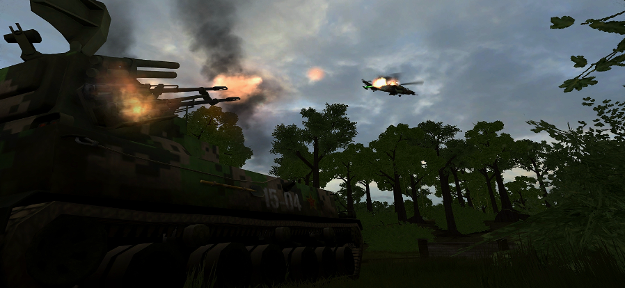

# Imperícia Squads Aéreas

## TRANSPORTE (TRANS)


_<mark style="color:orange;">A imperícia na</mark> <mark style="color:orange;"></mark><mark style="color:orange;">**Squad TRANS**</mark> <mark style="color:orange;"></mark><mark style="color:orange;">pode comprometer severamente as operações de transporte e logística da equipe, levando a perdas de veículos, suprimentos e tropas. Para evitar isso, é fundamental treinar, coordenar e priorizar a segurança e a eficiência em todas as operações, mantendo sempre uma comunicação ativa com a equipe.</mark>_



* <mark style="color:yellow;">**Pousos imprudentes:**</mark> <mark style="color:red;">Pousar em zonas de combate sem garantir a segurança do local pode resultar em destruição do helicóptero, mortes de tropas e a perda de suprimentos. Um piloto inexperiente ou imperito pode escolher áreas inadequadas para pouso, expondo o veículo a armas antiaéreas, RPGs ou fogo pesado de infantaria.</mark>
*

    <figure><figcaption></figcaption></figure>
*   <mark style="color:yellow;">**Voo em baixa altitude em áreas perigosas:**</mark>** **<mark style="color:red;">**Voar muito baixo em áreas conhecidas por emboscadas ou com forte presença inimiga aumenta drasticamente o risco de ser derrubado.**</mark>

    <figure><figcaption></figcaption></figure>


## CAS (Close Air Support)


_<mark style="color:orange;">A imperícia na</mark> <mark style="color:orange;"></mark><mark style="color:orange;">**Squad CAS**</mark> <mark style="color:orange;"></mark><mark style="color:orange;">pode comprometer a eficácia de toda a equipe, resultando na perda de aeronaves valiosas e no fracasso em operações cruciais de suporte aéreo. Para evitar isso, é necessário que os pilotos estejam bem treinados, coordenem-se constantemente com as tropas no solo e realizem ataques precisos e eficazes. O</mark> <mark style="color:orange;"></mark><mark style="color:orange;">**CAS**</mark> <mark style="color:orange;"></mark><mark style="color:orange;">não é apenas uma função de ataque, mas um papel de</mark> <mark style="color:orange;"></mark><mark style="color:orange;">**suporte tático essencial**</mark> <mark style="color:orange;"></mark><mark style="color:orange;">para o sucesso geral da equipe no campo de batalha</mark>_


<figure><figcaption></figcaption></figure>



* <mark style="color:yellow;">**Ataques descuidados em zonas de combate sem confirmação visual de alvos:**</mark>** **<mark style="color:red;">**Pilotos imperitos podem atacar áreas sem verificar adequadamente a presença de aliados ou sem coordenar com os esquadrões terrestres, resultando em teamkills ou em ataques desperdiçados.**</mark>

<mark style="color:red;">**Consequências:**</mark>

* <mark style="color:red;">Perda de recursos valiosos como helicópteros ou caças de ataque.</mark>
* <mark style="color:red;">Teamkills que desmotivam a equipe e prejudicam as operações.</mark>
* <mark style="color:red;">Ineficiência no campo de batalha, já que ataques aéreos mal planejados podem deixar unidades inimigas intactas e as tropas aliadas vulneráveis.</mark>
* <mark style="color:yellow;">**Mau Uso de Armamento e Munição:**</mark>

<mark style="color:red;">O CAS possui armamentos limitados e poderosos, como mísseis teleguiados, foguetes e bombas de precisão. A</mark> <mark style="color:red;"></mark><mark style="color:red;">**imperícia no uso de armamentos**</mark> <mark style="color:red;"></mark><mark style="color:red;">pode incluir:</mark>

* <mark style="color:red;">**Gastar munição em alvos de baixo valor estratégico:**</mark> <mark style="color:red;"></mark><mark style="color:red;">Atirar em veículos leves ou alvos que não representam uma ameaça imediata, desperdiçando munição que poderia ser usada contra blindados pesados ou posições fortificadas.</mark>
* <mark style="color:red;">**Uso incorreto de armamentos em áreas próximas a aliados:**</mark> <mark style="color:red;"></mark><mark style="color:red;">Pilotos que não utilizam o armamento correto para a situação (como usar mísseis guiados em áreas urbanas com aliados próximos) podem causar teamkills ou danos colaterais significativos.</mark>

***

* <mark style="color:yellow;">**Ignorar a situação das defesas inimigas:**</mark> <mark style="color:yellow;"></mark><mark style="color:yellow;">Um piloto que não verifica a presença de defesas antiaéreas pode rapidamente perder a aeronave. O reconhecimento de áreas com alto risco de defesas inimigas é crucial para a sobrevivência da</mark> <mark style="color:yellow;"></mark><mark style="color:yellow;">**Squad CAS**</mark>


## Importância do JTAC:



Binóculos com Designação a Laser:

Os binóculos com **designação a laser** são uma ferramenta comum para JTACs. Eles permitem marcar alvos a longas distâncias e fornecer dados precisos para mísseis guiados. O piloto da CAS pode travar os mísseis no alvo designado, garantindo precisão.



Comunicação:

Manter contato com o CAS, fornecendo coordenadas e orientações para os ataques.



Flares e Fumaça para Sinalização:

Quando a precisão a laser não é possível, o JTAC pode usar **flares ou granadas de fumaça** para marcar alvos visualmente. Isso é útil para indicar áreas específicas para o CAS atacar ou evitar.




<mark style="color:purple;">FAQ: Como assim JTAC?</mark>

<mark style="color:blue;">R:</mark> <mark style="color:green;">JTAC Geralmente são os jogadores do Squad CAS (Não Necessariamente); Que estão em campo com KIT SPOTTER ou até mesmo KIT LIDER.. Por Possuir Estes KIT eles conseguem tanto mandar Lazer e sinalizar com Smoke Personalizada</mark>



<figure><figcaption>
Ao Mandar LAZER, verifique se o mesmo está ON
</figcaption></figure>


Todas as partidas estão gravadas e estão disponiveis para consulta!

